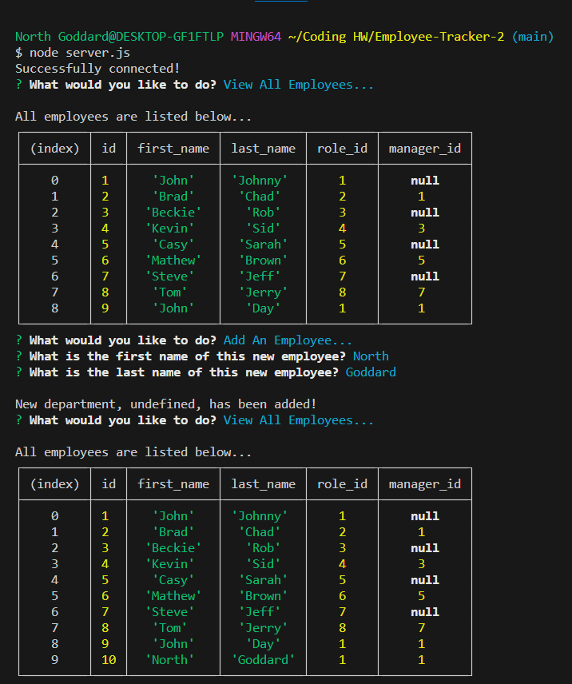

# Employee-Tracker

## Table of Contents 

- [Description](#description)
- [Images](#description)
- [Link](#link)
- [Creator](#creator)

## Description

This application is a command-line application developed using Node.js, Inquirer, and MySQL db to create an app that can store data on employees. This data includes roles, first and last names, departments, and even salarys. By using "node server.js" you can start the app and begin looking at the options in the terminal based on your goals.

## Images

## Link 

## Creator

- North Goddard (https://github.com/northgoddard)